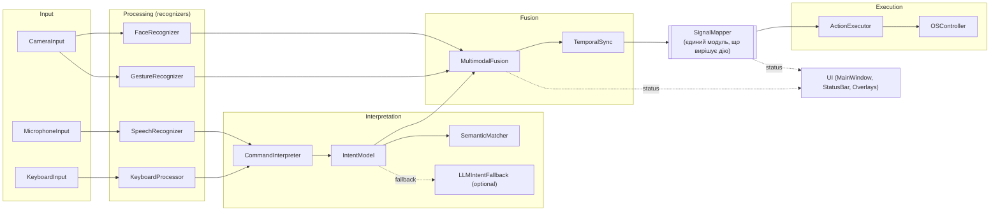

# Архітектура: потік даних через EventBus

Написано вручну на основі README та реальних імпортів у `src/main.py`
(автоматично згенеровані діаграми залежностей — у сусідніх файлах цієї
папки). Кожна стрілка нижче фізично реалізована як
publish/subscribe через спільний `core.event_bus.EventBus` — жоден модуль
не викликає інший напряму.

## Як переглянути / редагувати

- **VS Code**: розширення "Markdown Preview Mermaid Support" — відкрий
  цей файл і `Cmd+Shift+V`.
- **GitHub**: рендериться нативно, якщо запушити файл у репозиторій.
- **Онлайн-редактор**: скопіюй вміст блоку `mermaid` на
  [mermaid.live](https://mermaid.live) — там же можна редагувати й
  експортувати в PNG/SVG.

## Чому саме так намальовано

Прямий порядок стрілок відповідає односпрямованому пайплайну з README:
`Input -> Processing -> Interpretation/Fusion -> SignalMapper ->
ActionExecutor -> OSController`. UI показаний окремо, оскільки він лише
підписується на стан для відображення (status bar, overlays), а не бере
участі у прийнятті рішень.
